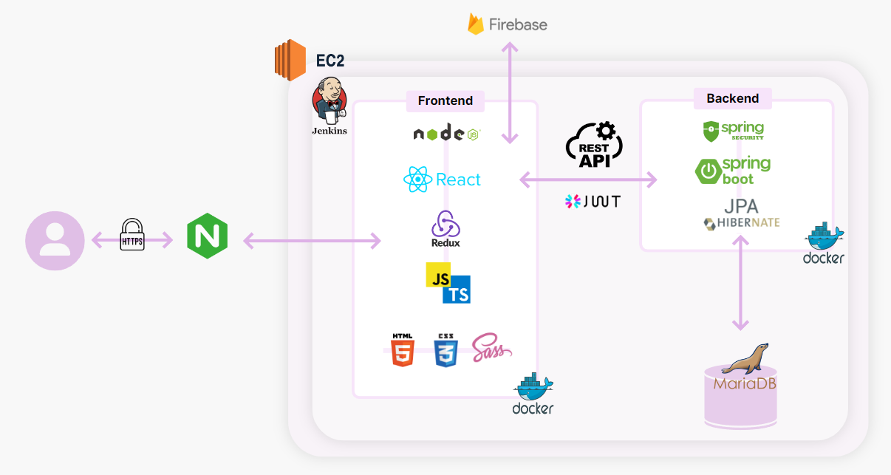
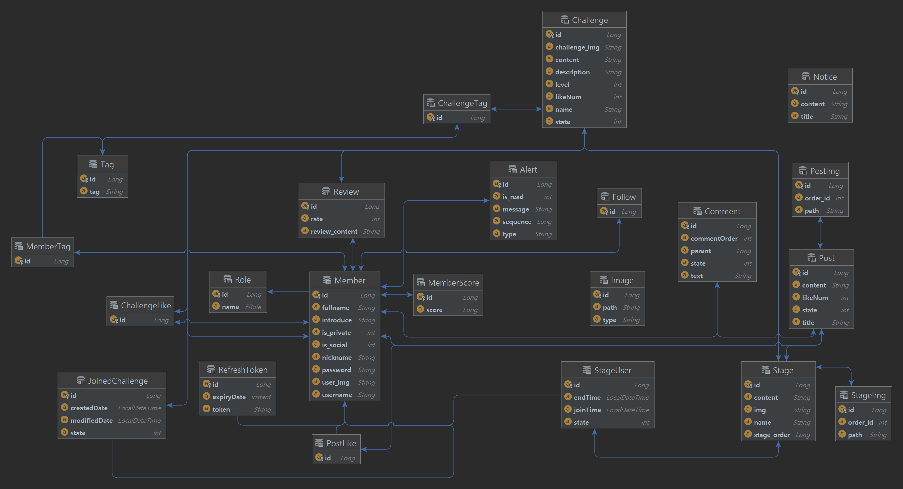
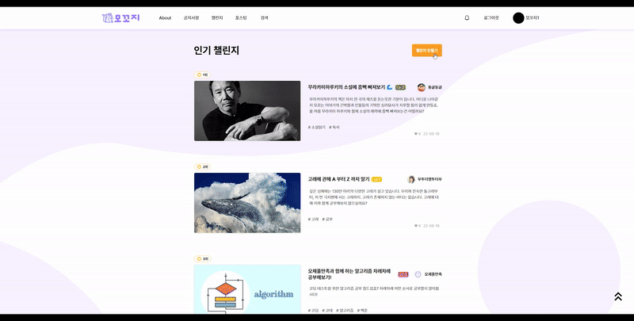
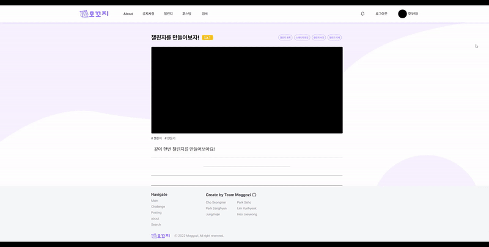
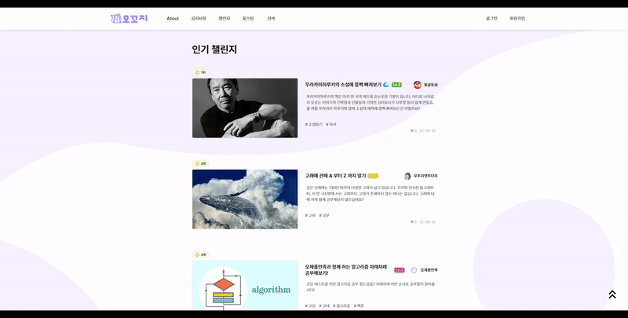
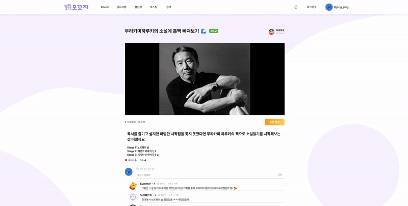
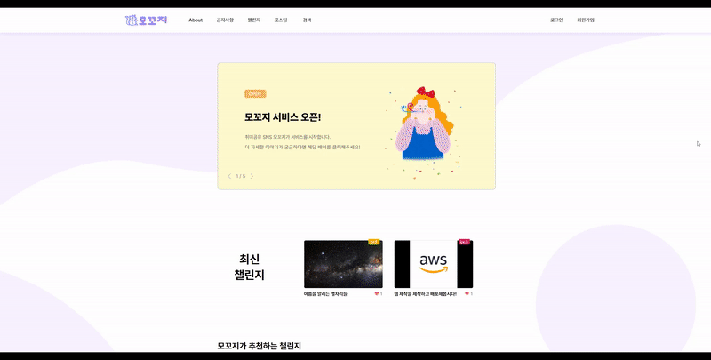

# 취미공유 서비스: 모꼬지 

##### 📑 목차

- [1. 소개](#1-소개)
- [2. 주요 기능](#2-주요-기능)
- [3. 아키텍처](#3-아키텍처)
- [4. ERD 다이어그램](#4-erd-다이어그램)
- [5. 시연시나리오](#5-시연시나리오)
- [6. 개발자](#6-개발자)
- [7. 개발하면서 생긴 의문점과 기술적 고민](#7-개발하면서-생긴-의문점과-기술적-고민)
	- [Front Issues](#git-front-issues)
	- [Back Issues](#git-back-issues)
	- [기술적 고민](#기술적-고민)
- [8. 기타 자료](#8-기타-자료)
	- [모꼬지 요구사항 정의서](#모꼬지-요구사항-정의서)
	- [모꼬지 사용자 흐름도](#모꼬지-사용자-흐름도)
	- [모꼬지 와이어프레임](#모꼬지-와이어프레임)
	- [모꼬지 API 문서](#모꼬지-api-문서)
	- [모꼬지 포팅 매뉴얼](#모꼬지-포팅-매뉴얼)
	- [모꼬지 시연시나리오](#모꼬지-시연시나리오)
	- [모꼬지 시연영상](#모꼬지-ucc)


---

<br/>

## 1. 소개

취미 공유 웹사이트 모꼬지는 **여러 사람들이 다양한 취미를 차근차근 밟아 나갈 수 있는 서비스**를 제공. 
모꼬지는 **'함께 어울려 즐기다'** 라는 순 우리말로 어떤 형태의 취미든 마음껏 즐길 수 있습니다. 
저희는 **'챌린지'** 를 통해서 그동안 관심있었던 취미에 쉽게 도전할 수 있도록 돕습니다. 
또한, '챌린지' 별 **'스테이지'** 라는 과제를 구성해서 부담없이 취미를 즐길 수 있도록 하였습니다. 
모꼬지에서는 유저가 기획자가 되어 자신만의 노하우로 챌린지를 만들 수도 있습니다. 
취미를 시작하고 싶지만 어떻게 시작할지 몰랐던 사람들에게 자신만 알고있기엔 아까웠던 취미 노하우를 마음껏 공유할 수 있는 공간, 그리하여 거창한 취미가 아니더라도 모두가 자신만의 취미를 즐길 수 있도록 돕는 공간, 모꼬지가 지향하는 가치입니다.<br/>

<br/>

## 2. 주요 기능

> *모꼬지에서 제공하는 주요 기능입니다. 
> 서비스를 이해하기 위한 용어를 정의하고 각 기능에서 어떤 것을 경험할 수 있는지 설명하였습니다. 
> 이미지와 함께 자세한 설명은 [5.시연시나리오](#5-시연시나리오) 에서 확인하세요!* 

<br/>

#### 1) 회원 가입 및 로그인

- 모꼬지 사이트 내에서 회원가입 및 로그인을 진행할 수 있습니다.
- 사용자의 편의를 위해 구글, 카카오, 네이버 계정을 통해 회원가입 및 로그인을 진행할 수 있도록 하였습니다.


#### 2) 챌린지

* 모꼬지에서 챌린지란 각 취미별로 도전할 수 있는 큰 과제를 의미합니다.
* 예를 들어 식물키우기라는 취미가 있다면 '꽃 키우기', '고구마 키우기', '선인장 키우기' 등이 챌린지로 등록될 수 있습니다. 


#### 3) 스테이지

* 챌린지가 큰 과제라면 스테이지는 큰 과제를 이루는 작은 도전 과제들을 의미합니다.
* '고구마 키우기'라는 챌린지에는 '씨앗 심기', '흙 선별하기', '새싹 틔우기' 등이 스테이지로 등록될 수 있습니다.


#### 4) 포스팅

* 스테이지를 성공적으로 끝냈다면, 사용자는 결과를 포스팅할 수 있습니다.
* 에디터를 이용하여 사진과 자신만의 스타일로 커스텀하여 글을 꾸밀 수 있습니다.
* 다양한 유저들이 포스팅을 볼 수 있고 댓글을 달 수 있습니다.


#### 5) 검색 

* 유저 닉네임, 챌린지 명, 태그 명으로 실시간 검색이 가능합니다.


#### 6) 유저페이지 - 팔로우/팔로워 

* 유저페이지에서 자신이 만든 챌린지, 도전 중인 챌린지, 작성한 포스팅을 확인할 수 있습니다.
* 팔로우/팔로워하는 사람을 확인할 수 있습니다.
  * 팔로우 리스트를 열면 로그인한 유저가 상대를 팔로우하는지 아닌지에 따라 팔로우 버튼이 활성화 됩니다.
* 타 유저의 페이지에 방문하여 타유저의 활동을 확인하고 좋아요를 누를 수 있습니다.

---

<br/>

## 3. 아키텍처

<br/>

#### 1) 아키텍처




<br/>

#### 2) 기술스택

|      Part      |                            Tech ⚙                            |
| :------------: | :----------------------------------------------------------: |
|   **Front**    |   |
|    **Back**    |  |
| **Deployment** |  |


- **OS**: Windows 10

* **사용 IDE**
  * IntelliJ IDEA 2022.1.3
  * Visual Studio Code : 1.70.2v
  * UI/UX: Figma


* **백엔드 기술스택**
  * Springboot : 2.6.9
  * MariaDB : mariadb Ver 15.1 Distrib 10.3.34-MariaDB, for debian-linux-gnu (x86_64) using readline 5.2
  * AWS : ubuntu 20.04.4 LTS 
  * Jenkins : 2.346.2
  * Docker : 20.10.17
  * Openjdk : 11.0.16
  * Spring: gradle 
  * nginx : nginx/1.18.0 (Ubuntu)


* **프론트엔드 기술스택**
  * node.js : 16.15.0v 64bit (LST 버전 사용)
  * npm : 8.5.5v
  * react : 18.2.0v
  * react-router-dom : 6.3.0v
  * react-redux : 8.0.2v
  * redux Toolkit : 1.8.3v
  * TypeScript : 4.7.4v
  * Sass : 1.54.4v

---

<br/>

## 4. ERD 다이어그램



---

<br/>

## 5. 시연시나리오

> *```README```에서는 주요 기능만을 설명합니다. 자세한 시나리오가 궁금하시다면 [모꼬지 시연시나리오](https://drive.google.com/file/d/1Zw85PwF_qezx5kxNaeFc6XjYAOArsewl/view?usp=sharing)를 참고해주세요!*

<br/>

#### 1) 메인페이지


<br/>

#### 2) 챌린지 및 스테이지 

- **챌린지 페이지**


* **챌린지 생성**



<br/>

* **스테이지 생성** 



<br/>

* **챌린지 상세페이지**



<br/>

* **한줄평**



<br/>


#### 3) 검색



---

<br/>

## 6. 개발자


#### 1) Front

* [박세호](https://github.com/seho27060): 실시간 알림, 포스팅
* [임윤혁](https://github.com/yunhlim): 챌린지, 스테이지 및 전체적인 CRUD, 파이어베이스
* [허재영](https://github.com/DasisCore): 웹 디자인, 유저, Sass


 #### 2) Back

* [박상현](https://github.com/nomzaxs): 서버, 포스팅 API
* [정호진](https://github.com/junghojin): 스프링 시큐리티, 유저 API, 문서화
* [조성민(팀장)](https://github.com/WeedInGist): 챌린지 API, 스테이지 API, 알림 

---

<br/>

## 7. 개발하면서 생긴 의문점과 기술적 고민

> *우리는 프로젝트 진행을 위해 많은 것을 익혔고, 그리고 다양한 문제들을 만났습니다. 프로젝트 완성 후에도 개선할 수 있는 부분들에 관해 고민하였습니다.*
> *해당 내용을 깃과, 블로그에 정리하였습니다. 링크를 클릭하시면 이동하실 수 있습니다.*

### 내 기술적 고민
```// 곧 업데이트 됩니다.```

1. [이미지를 자체 서버에 저장하지 않고 파이어베이스를 사용한 이유는?]()
6. [웹 페이지 이동 시간을 줄이기 위해 노력한 점은?]()
8. [https 를 적용한 이유는? 적용하면서 발생했던 어려움은 무엇일까?]()
4. [Session이 아닌, JWT 토큰을 사용한 이유는?]()

---

<br/>

## 8. 기타 자료

> *링크를 누르시면 해당 페이지로 이동합니다.*
#### [모꼬지 팀의 Git 전략 및 Convention]() // 곧 업데이트 될 예정입니다.

#### [모꼬지 팀의 Jira 사용 - Scrum]() // 곧 업데이트 될 예정입니다.

#### [모꼬지 요구사항 정의서](exec/모꼬지 요구사항 정의서.docx)

#### [모꼬지 사용자 흐름도](exec/모꼬지 사용자흐름도.docx)

#### [모꼬지 와이어프레임](https://www.figma.com/file/bWvgf20dimmd7qJyU9fQcv/Untitled?node-id=0%3A1)

#### [모꼬지 목업](https://www.figma.com/file/hTVofDNOmW8qJBeBOQacnj/moggozi?node-id=275%3A1474)

#### [모꼬지 API 문서](https://www.notion.so/junghojin/API-40d71786c59c4079916b9f8c5c305423)

#### [모꼬지 포팅 매뉴얼](exec/모꼬지 포팅 매뉴얼.pdf)

#### [모꼬지 시연시나리오](exec/모꼬지 시연시나리오.pdf)

#### [모꼬지 시연영상](https://youtu.be/TBeAkZz2-g0)

<br/>

> *If you have any questions to this project, please contact to <br/><br/>
> Developer 임윤혁(Lim Yunhyeok) (yunh04131@gmail.com) - Front <br/><br/>
> Developer 허재영(Heo Jaeyeong) (gj3034@gmail.com) - Front <br/><br/>
> Developer 정호진(Jung hojin) (hojinnjung@gmail.com) - Back*
